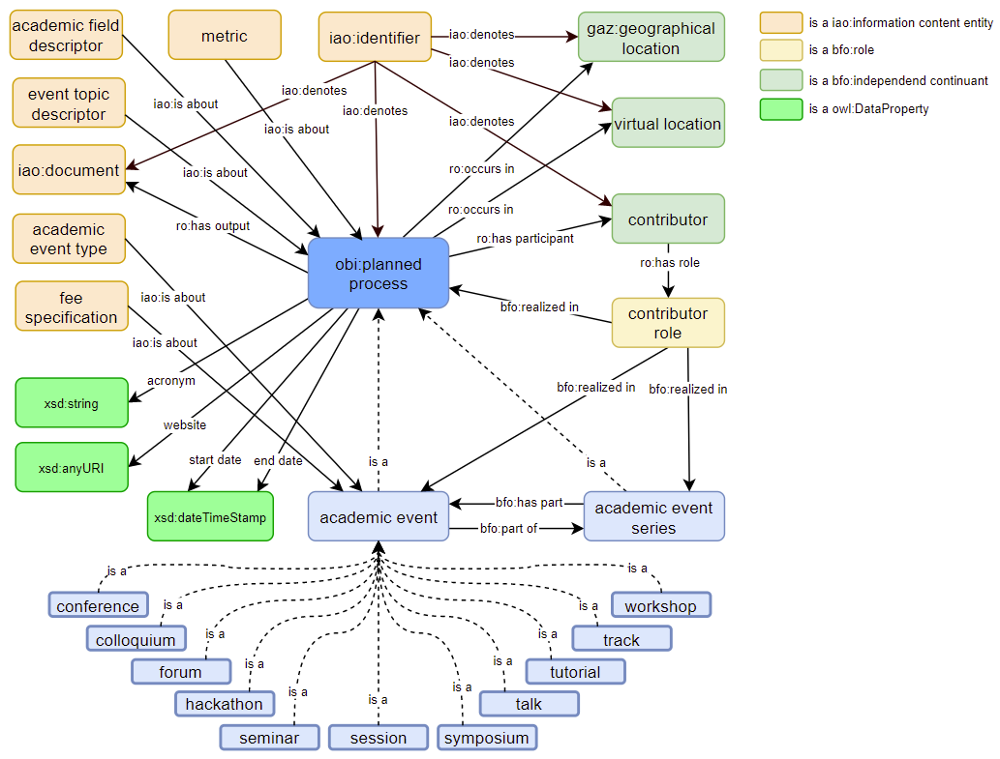
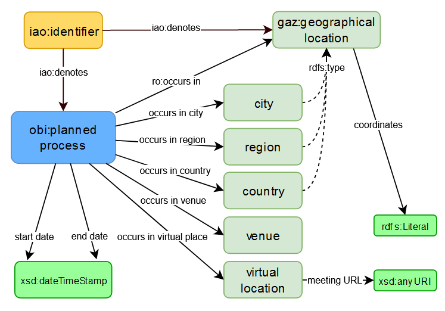
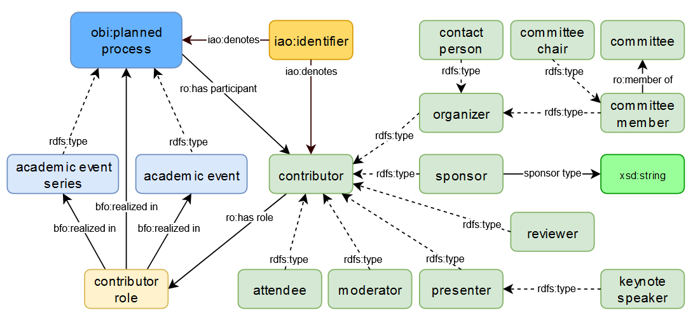
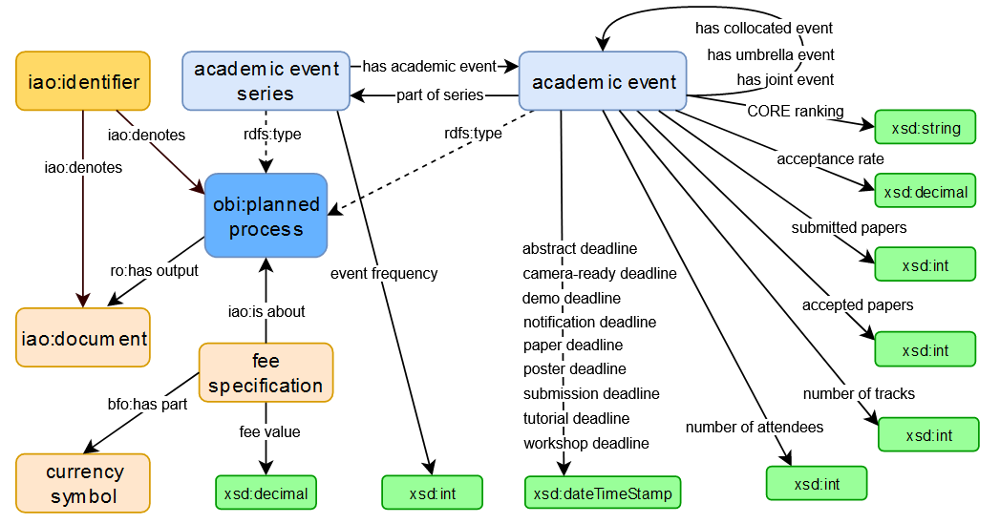

# Academic Event Ontology (AEON)
## Context

AEON is currently a work in progress and far from a final product, as can be seen by the version number. It\'s not ready for productive systems.

A first draft of AEON was discussed at the [VIVO Ontology Workshop in February 2020](https://docs.google.com/document/d/1C9vs3_pCqhS_ujcqmUeu9TSXtgxFIvsBv-fW3sXl7yk) with regard to the process of renewing the VIVO ontology to make it [BFO](https://basic-formal-ontology.org/) conform.

The application ontology of the TIB project [ConfIDent](https://projects.tib.eu/en/confident/), will hopefully serve as meaningful input for AEON, due to its data driven development. This entails importing academic event metadata from donators and existing datasets, such as [OpenResearch](https://www.openresearch.org), [EventKG](https://github.com/saidfathalla/EVENTSKG-Dataset), [DBLP](http://dblp2.uni-trier.de/) and [NASA/ADS](https://ui.adsabs.harvard.edu/), in order to identify the needed classes, object and data properties by analysing their relevance in these datasets.

Additional analysis is needed regarding the reuse of external terms from related ontologies and schemas, such as:

- [SEO - The Scientific Event Ontology](http://kddste.sda.tech/SEOontology/Documentation/)

    - reuses:
    
        - [Semantic Web for Research Communities Ontology](https://lov.linkeddata.es/dataset/lov/vocabs/swrc)

        - the [conference-ontology](http://www.scholarlydata.org/ontology/conference-ontology.owl) from scholarlydata.org

-   [schema.org/event](http://www.schema.org/event) & [schema.org/eventseries](http://www.schema.org/eventseries)

-   [GND Ontology](https://d-nb.info/standards/elementset/gnd) (not very elaborate for events)

-   [BIBO](http://bibliontology.com/) has some classes for conferences and alike events

-   [FRAPO](https://sparontologies.github.io/frapo/current/frapo.html#d4e2645) - has classes like conference fee etc.

-   [FaBiO](https://sparontologies.github.io/fabio/current/fabio.html) - has classes for publications as conference output

## [Domain Definition](https://docs.google.com/document/d/1e7MWIO7IZHtj1Ww-pXswcQVDO7rIs8aQwwgnKk2KQ-o)

An academic event is a gathering of scholars and researchers to present their work, hear others present, and discuss the latest developments within their field. Some examples of academic events include conferences, symposia, workshops, colloquia, talks, hackathons, meet-ups, seminars, and forums.

The Academic Event Ontology (AEON) is used to represent information regarding academic events. The ontology supports the identification, development, management, evaluation, and impact assessment of events, components of events and event series, as well as identification and reuse of works presented or developed at events. The ontology is independent of knowledge, creative domain, or topics related to events. AEON is focused on events and assumes the representation of many entities associated with events such as attendees, locations, academic works, datetimes, and processes are defined in compatible ontologies.

## Ontology Competency Questions

AEON seeks to represent information about events to answer the questions below as examples. Many additional questions regarding events should be answerable.

1.  Basic information about the event: its date, type (conference, workshop, symposium, etc.) location (including multiple and virtual), topics, name, program/agenda

2.  Who attended the event? Who presented? Who served on panels?

3.  What deadlines are associated with the event such as registration, submission

4.  Who was on the organizing committee? Who were the local organizers? The reviewers?

5.  Was the event part of a series? Who is responsible for the series?

6.  Who won awards presented at the event?

7.  What material was presented at the event? (e.g. papers, posters, presentations, demonstrations)

8.  Were there panel sessions, workshops? Who attended them?

## Consequences and observations

-   AEON represents information useful in assessing the research impact of an event.

-   Awards are outside the domain of AEON. AEON will represent awards using ontology developed for that purpose.

-   AEON is a BFO-based ontology that recognizes roles, processes, and process outputs. So, for example, a person might have the role attendee in an event. A person might have a chair role in an organizing committee associated with the event.

-   An event defined by this ontology produces outputs that are information artifacts ([http://www.obofoundry.org/ontology/iao.html](http://www.obofoundry.org/ontology/iao.html)). These outputs can be referenced, but they are not in the scope of this ontology.

-   An academic event has one or more topics. Defining topics is outside the scope of this ontology. Existing topic vocabularies can be used with AEON.

-   Events are defined in a general manner with sub-events (occurrent parts) that are themselves events. This allows for the representation of conferences that have workshops with their own organizing committees, for example.

-   Events without much structure are often called "meetings."

## Visualization
You can see a visualization of the master branch aeon.ttl using [WebVOWL](http://www.visualdataweb.de/webvowl/#iri=https://raw.githubusercontent.com/tibonto/aeon/master/aeon.ttl)

### TBoxes
This is a reduced general overview of the classes and relation AEON uses.
CAVE/TODO: I've wrongly labeled the edges for the subclasses wrong, so it must be rdfs:subclassOf not rdf:type! see also [issue#105] (https://github.com/tibonto/aeon/issues/105) (PS)

#### What makes up an academic event or event series?

CAVE/TODO: I've used SKOS wrong! The academic event type, academic field & topic need to be subsumed under iao:information content entity somehow. See also WIP [issue#51] (https://github.com/tibonto/aeon/issues/51) (PS)

When looking at the international use of terms like e.g. conference, symposiom or forum, we must acknowledge that there are sociocultural diffences in the meaning, that prevent us from simply defining them as subclasses of 'aeon:academic event' or 'aeon:academic event series'. Hence, we chose to model the type of an academic event as an instance of skos:Concept for now.
The instances of 'aeon:academic field' are intended to be owl:NamedIndividuals derived from an established controlled vocabulary that classifies the various subject areas (e.g. [DFG subject areas](https://www.dfg.de/en/dfg_profile/statutory_bodies/review_boards/subject_areas/index.jsp))
The instances of 'aeon:topic' on the other hand are intended to be owl:NamedIndividuals that can be used to describe the research area of an academic event or event series without having to adhere to a controlled vocabulary. Thus making it easier to further specifiy the research area when the used controlled vocabulary is not specific enough.
It needs to be discussed if it is better to subsume these three classes under 'iao:information content entiy'. 

#### Where and when did it take place?

We've added subproperties of 'ro:occurs in' in order to be able to map the data from external databases such as Wikidata more precisely. 

#### Who is involved?

The contributors are defined classes, that are equivalent to ('Homo sapiens' or organization) and ('has role' some ('contributor role' and ('realized in' some 'planned process'))). For the sake of reducing the information overload the discrete roles for each type of contributor (e.g. 'aeon:organizer role', 'aeon:presenter role', ...) are thus left out here. What is also not shown in this figure are additional subproperties of 'ro:has participant' (e.g. 'aeon:has contributor', 'aeon:has organizer', ...) with which we can specify the type of participation more concretely, by adhering to the pattern that a contributor role is equivalent to 'role of' some ('contributes to' some 'planned process'). At the moment these axioms have been asserted manually, but it is intended to do this automatically via macro expansion. 

Similarly to AEONs subproperties of 'ro:occurs in', havin additional subproperties of 'ro:has participant' is needed for the mapping to external databases and in general for those applications that do not define the participation in an academic event or event series via a destinct role.

#### How is the event or series organized?

This is still a very early draft and it needs to be discussed if and how the various metrics and deadlines can be modeled better using classes and object properties instead of just data properties.

## Development
It is intended to have a CI/CD pipeline for the development. Unfortunately the use of the ODK is not possible at the moment due to too old IT. The plan is to migrate to using it when this changes. Until then, we try to make as much as possible with ROBOT and GitHub actions/workflows. Using TSV-templates and a better repo folder structure is planned, but we need to learn this first in the little time we have for this project ;)
### Tests
**Tests `tests/` are run at every merge request and push into the master branch, by github actions.**

github actions are define in `.github/workflows/`

But if test are to be run locally, follow the instructions in next sections

#### Create test enviroment
* create python virtual environment
* install python libaries `pip install -r requirements.txt`
* test files are located in `tests/` dir and start with test*.py
* test definitions, such as markers are set in `pytest.ini`

#### Run tests
* **all tests**: `pytest`  
* **some tests**, using the marker to specify which tests, ie: `pytest -m ontology`

